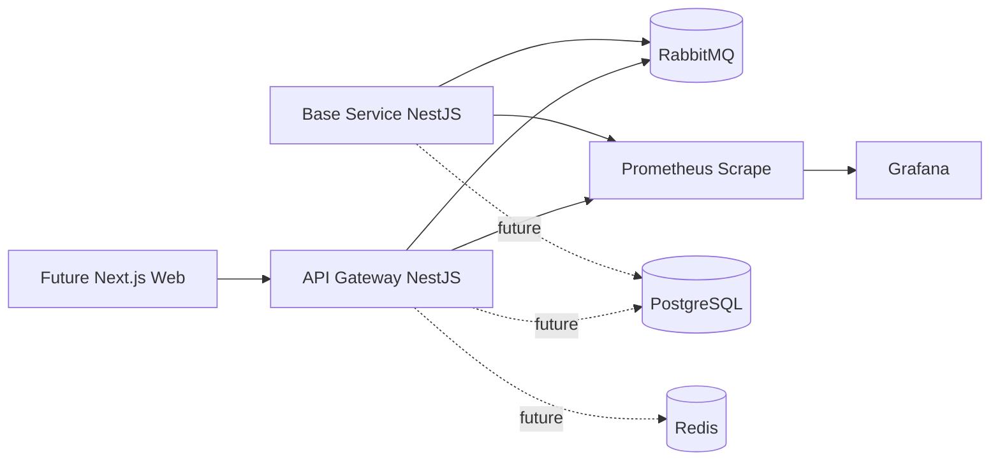

# Northlane Apparel

Northlane Apparel is an event-driven apparel e-commerce platform built as a professional monorepo. This repository is currently in **Phase 1**, focused on the foundation: npm workspaces, local infrastructure, a basic NestJS API Gateway, one base microservice, RabbitMQ topology bootstrap, observability endpoints and root automation commands.

The project intentionally does **not** include catalog, cart, orders or payments yet. Those domains will be added in later phases on top of this foundation.

## Current Architecture



## Implemented in Phase 1

- npm workspaces monorepo.
- Turborepo task orchestration.
- TypeScript strict base configuration.
- ESLint and Prettier configuration.
- Docker Compose with PostgreSQL, RabbitMQ Management, Redis, Prometheus and Grafana.
- Basic NestJS API Gateway.
- Basic NestJS microservice named `base-service`.
- Shared package for service config, JSON logger, correlation ID middleware, Prometheus registry and RabbitMQ topology helpers.
- Root Makefile with local development commands.
- `.env.example` for local configuration.

## Local URLs

| Component | URL |
|---|---|
| API Gateway health | `http://localhost:4000/health` |
| API Gateway status | `http://localhost:4000/api/v1/status` |
| API Gateway metrics | `http://localhost:4000/metrics` |
| Base Service health | `http://localhost:3001/health` |
| Base Service status | `http://localhost:3001/status` |
| Base Service metrics | `http://localhost:3001/metrics` |
| RabbitMQ Management | `http://localhost:15672` |
| Prometheus | `http://localhost:9090` |
| Grafana | `http://localhost:3002` |

Default local RabbitMQ credentials are `northlane / northlane`. Default Grafana credentials are `admin / admin`.

## Requirements

- Node.js 22 or newer.
- npm 10 or newer.
- Docker and Docker Compose.
- `make` for root Makefile commands.

## Commands

```bash
make install
make up
make dev
make logs
make down
make lint
make test
make build
make docker-build
make clean
```

## Development Flow

1. Create a local `.env` using `.env.example` as the source of truth.
2. Run `make install`.
3. Run `make up` to start PostgreSQL, RabbitMQ, Redis, Prometheus, Grafana and the two Node services.
4. Run `make dev` when developing the NestJS services locally outside Docker.

## Workspace Layout

```text
apps/
  api-gateway/
services/
  base-service/
packages/
  shared/
infra/
  docker/
  prometheus/
  grafana/
scripts/
  migrations/
  seed/
```

## Design Notes

- The API Gateway is intentionally thin. It exposes HTTP and will later translate public API requests into RabbitMQ commands and request/reply messages.
- The base service proves the microservice template: NestJS bootstrap, health endpoint, metrics endpoint, correlation ID middleware and RabbitMQ topology assertion.
- RabbitMQ uses separate direct command exchanges and topic event exchanges. This avoids the invalid pattern of trying to use one exchange as both direct and topic.
- PostgreSQL is available in Phase 1, but service-owned Prisma schemas and migrations start when real domain services are introduced.
- Redis is available for later rate limiting, cache and temporary state use cases.

## Phase 1 Scope Boundary

Not implemented yet:

- Next.js frontend.
- Catalog domain.
- Cart domain.
- Checkout saga.
- Order domain.
- Payment domain.
- User/auth flows.
- Terraform cloud infrastructure.
- GitHub Actions CI/CD.

These will be added incrementally after the foundation is stable.
