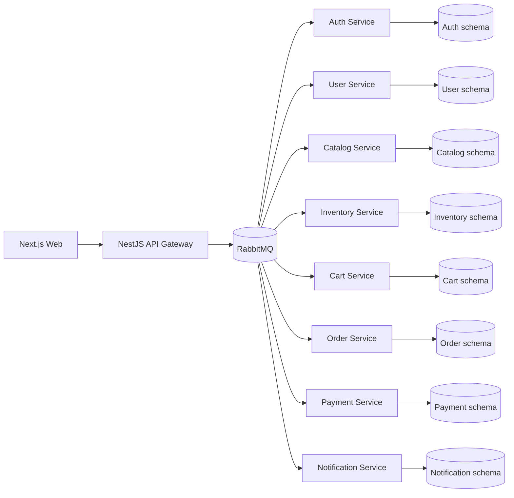

# Northlane Apparel

Northlane Apparel is an event-driven apparel e-commerce platform built as a production-oriented monorepo. It includes a localized Next.js storefront, a NestJS API Gateway, service-owned PostgreSQL schemas, RabbitMQ-based service communication, a checkout saga, Mercado Pago Checkout Pro support, local observability and a documented AWS ECS Fargate deployment path.

## Stack

- npm workspaces and Turborepo
- Next.js App Router, React, TypeScript and Tailwind CSS
- TanStack Query, Zustand, React Hook Form and Zod
- NestJS API Gateway and NestJS microservices
- RabbitMQ, PostgreSQL, Prisma and Redis
- Mercado Pago Checkout Pro plus deterministic MOCK payments
- Prometheus, Grafana, Loki and Grafana Alloy for local observability
- Terraform for AWS ECS Fargate, ECR, ALB, RDS, Secrets Manager and optional Amazon MQ/Redis

## Architecture



The frontend talks only to API Gateway. Internal service-to-service communication stays on RabbitMQ. Each service owns its data model and Prisma migrations.

## Repository Map

```text
apps/
  api-gateway/        Public HTTP boundary, Swagger docs and frontend-facing APIs
  web/                Localized customer storefront and account/admin UI
services/
  auth-service/       Credentials, sessions and roles
  user-service/       Profiles and addresses
  catalog-service/    Products, categories, brands, variants and media
  inventory-service/  Stock items, reservations and movements
  cart-service/       Active carts and item snapshots
  order-service/      Checkout saga state and order history
  payment-service/    MOCK and Mercado Pago payment ownership
  notification-service/
packages/
  contracts/          RabbitMQ command/event contracts
  shared/             Shared config, logging, metrics and messaging utilities
infra/
  docker/             Prometheus, Grafana, Loki and Alloy config
  terraform/          AWS dev infrastructure
docs/                 Operational and architecture documentation
```

## Quick Start

Create local configuration, run the project doctor, then start the full Docker stack:

```powershell
Copy-Item .env.example .env
make doctor
make up
```

If Windows App Control blocks `make.exe`, use the PowerShell wrapper:

```powershell
powershell -ExecutionPolicy Bypass -File .\scripts\dev\local-stack.ps1 doctor
powershell -ExecutionPolicy Bypass -File .\scripts\dev\local-stack.ps1 up
```

Local URLs:

| Service | URL |
| ------- | --- |
| Storefront | `http://localhost:3000` |
| API Gateway | `http://localhost:4000/api/v1/health` |
| Swagger | `http://localhost:4000/api/docs` |
| RabbitMQ UI | `http://localhost:15672` |
| Prometheus | `http://localhost:9090` |
| Grafana | `http://localhost:3001` |

## Common Commands

```bash
make doctor          # Validate local tools, .env, payment mode and docker compose config
make up              # Build, bootstrap and start the full local stack
make start           # Start an already bootstrapped local stack
make down            # Stop local containers
make logs            # Follow local logs
make lint            # Run lint
make test            # Run deterministic tests
make test-e2e        # Run checkout saga smoke tests
make build           # Build the monorepo
make deploy-plan     # Review AWS Terraform changes
make deploy          # Deploy/update AWS dev infrastructure, images, secrets and ECS services
make deploy-status   # Show ECS service status
make destroy         # Destroy Terraform-managed dev infrastructure
```

`make destroy` is intentionally scoped to Terraform-managed dev infrastructure. It does not remove local Docker resources, and the deploy flow removes ECR repositories from Terraform state before destroy so pushed images can be reused unless you delete them manually.

## Documentation

Use the dedicated docs instead of expanding this README:

- [Local development](docs/local-development.md): Docker Compose, ports, bootstrap and live E2E.
- [Event-driven flow](docs/event-driven-flow.md): RabbitMQ contracts, retries, DLQ and saga flow.
- [Payment flow](docs/payment-flow.md): MOCK payments, Mercado Pago Checkout Pro, webhooks and test cards.
- [AWS architecture](docs/aws-architecture.md): ECS Fargate target design, ALB HTTPS and cost notes.
- [Deployment](docs/deployment.md): Terraform, ECR, ECS, RDS, secrets, migrations and destroy behavior.
- [Internationalization](docs/i18n.md): Spanish/English routing and translation structure.
- [Observability](docs/observability.md): Prometheus, Grafana, Loki and Alloy.
- [Testing and CI](docs/testing-and-ci.md): local quality gates and GitHub Actions coverage.

## Payment Modes

`PAYMENT_PROVIDER=MOCK` is the default for local deterministic development. It approves payments unless a test scenario requests failure.

`PAYMENT_PROVIDER=MERCADO_PAGO` creates a real Checkout Pro preference and returns a `checkoutUrl` to the frontend. Over a plain HTTP AWS ALB, the project uses demo mode to open Mercado Pago UI while final confirmation still depends on return synchronization and webhook availability. The full production-grade flow requires a domain, HTTPS on ALB through ACM, and a public webhook URL.

## Quality Gates

Before opening or updating a pull request, run:

```bash
make doctor
npm run prisma:generate
npm run lint
npm run typecheck
npm test
npm run test:e2e
npm run build
docker compose config --quiet
```

GitHub Actions runs the same core checks on pull requests to `main`.

## Scope

Implemented:

- Customer storefront, account pages, admin screens and i18n-ready localized routes.
- API Gateway with validation, security middleware, correlation IDs, structured logs and Swagger.
- Service-owned databases and RabbitMQ command/event contracts.
- Checkout saga across cart, order, inventory, payment and notification services.
- Mercado Pago Checkout Pro integration with MOCK fallback.
- Local observability stack and AWS dev infrastructure documentation.

Deferred:

- Production CI/CD automation.
- Production domain, ACM certificate and hardened HTTPS deployment.
- Real email provider integration.
