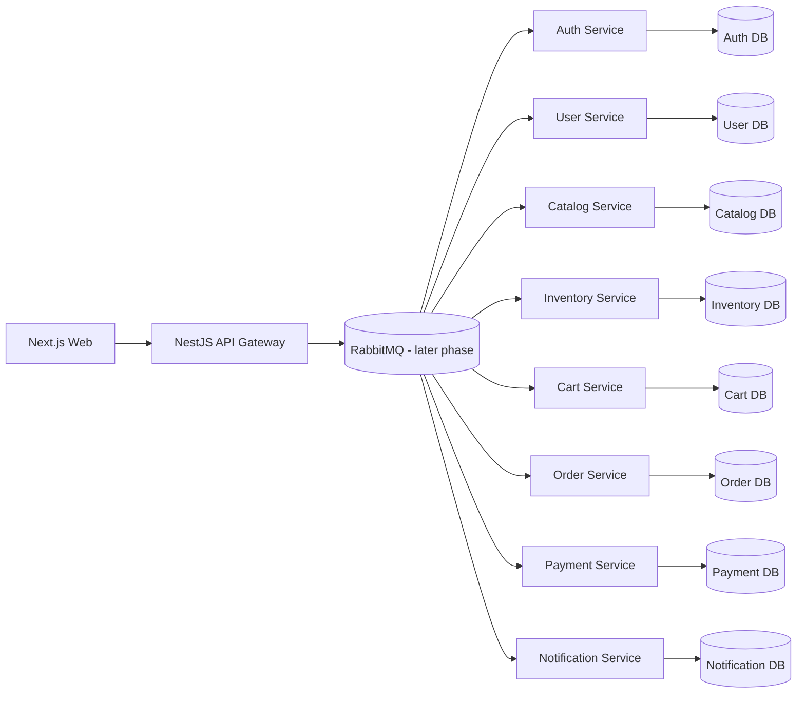

# Northlane Apparel

Northlane Apparel is the foundation for a professional event-driven apparel e-commerce platform. The repository is currently in **Phase 5**: it defines the monorepo structure, local infrastructure, API Gateway base, shared contracts and the first RabbitMQ-backed auth/user flow.

## Current Scope

Implemented now:

- npm workspaces.
- Turborepo as a script orchestrator only.
- Strict TypeScript base configuration.
- Minimal Next.js app in `apps/web`.
- NestJS API Gateway base in `apps/api-gateway` with `/api/v1`, health check, typed environment configuration, CORS, Helmet, rate limiting, structured request logs, correlation IDs, validation pipe and consistent error responses.
- Auth Service with Prisma-owned credentials tables, bcrypt password hashing, JWT access tokens, refresh tokens and RabbitMQ request/reply handlers.
- User Service with Prisma-owned profiles and addresses, plus `UserRegisteredEvent` consumption to create the initial profile.
- Eight NestJS service shells under `services/*`.
- Prisma schema placeholder per service.
- Shared and contracts packages.
- Local Docker Compose infrastructure for RabbitMQ, PostgreSQL and Redis.
- Initial Terraform directory without cloud infrastructure.
- Root Makefile with initial local commands.

Not implemented yet:

- Complete RabbitMQ topology, retries and DLQs.
- Product catalog, cart, checkout, orders or payments.
- Complete frontend UI.
- CI/CD or AWS deployment.

## Target Architecture



## Repository Layout

```text
apps/
  web/
  api-gateway/
services/
  auth-service/
  user-service/
  catalog-service/
  inventory-service/
  cart-service/
  order-service/
  payment-service/
  notification-service/
packages/
  shared/
  contracts/
infra/
  docker/
  terraform/
docs/
```

## Commands

```bash
make install
make dev
make up
make down
make logs
make build
make lint
make test
make clean
```

Equivalent npm commands:

```bash
npm install
npm run dev
npm run build
npm run lint
npm test
npm run clean
```

## Local Infrastructure

`make up` starts the local infrastructure required by later event-driven phases.

| Component | Local URL / Port | Default credentials |
|---|---|---|
| API Gateway | `http://localhost:4000/api/v1/health` | none |
| RabbitMQ AMQP | `localhost:5672` | `northlane / northlane` |
| RabbitMQ Management UI | `http://localhost:15672` | `northlane / northlane` |
| PostgreSQL | `localhost:5432` | `northlane / northlane` |
| Redis | `localhost:6379` | none |

Use `make logs` to follow container logs and `make down` to stop the stack. Persistent data is stored in named Docker volumes.

## API Gateway

The public HTTP boundary is available under `/api/v1`.

| Endpoint | Purpose |
|---|---|
| `GET /api/v1/health` | Health check for local and future container probes. |
| `POST /api/v1/auth/register` | Register a user through Auth Service request/reply. |
| `POST /api/v1/auth/login` | Login and issue access/refresh tokens. |
| `POST /api/v1/auth/refresh` | Rotate refresh token and issue a new access token. |
| `GET /api/v1/me` | Get the authenticated user's profile. |
| `PATCH /api/v1/me/profile` | Update personal profile data. |
| `GET /api/v1/me/addresses` | List authenticated user's addresses. |
| `POST /api/v1/me/addresses` | Create an address for the authenticated user. |
| `GET /api/v1/products` | Placeholder module boundary. |
| `GET /api/v1/cart` | Placeholder module boundary. |
| `GET /api/v1/checkout` | Placeholder module boundary. |
| `GET /api/v1/orders` | Placeholder module boundary. |
| `GET /api/v1/admin` | Placeholder module boundary. |

Every HTTP response includes or propagates `x-correlation-id`. Request logs are emitted as JSON and include the same correlation ID. Unhandled and HTTP errors use a consistent envelope with `success`, `statusCode`, `error`, `correlationId`, `path`, `method` and `timestamp`.

## Service Boundary Intent

- `apps/web`: future customer and admin frontend.
- `apps/api-gateway`: future public HTTP boundary for the frontend.
- `auth-service`: credentials, tokens and roles.
- `user-service`: profiles, addresses and contact data.
- `catalog-service`: products, categories, variants and merchandising data.
- `inventory-service`: stock ownership and reservations.
- `cart-service`: user carts and cart item snapshots.
- `order-service`: checkout saga state and order history.
- `payment-service`: payment processing abstraction.
- `notification-service`: email and notification history.

## Development Notes

Each service has its own `prisma/schema.prisma` file with an isolated datasource placeholder. Domain models and migrations are intentionally deferred until the corresponding service is implemented.

RabbitMQ is available locally as infrastructure and is used by the Phase 5 auth/user flow. Full retry policy, DLQs and production-grade topology management are intentionally deferred to a later phase.
