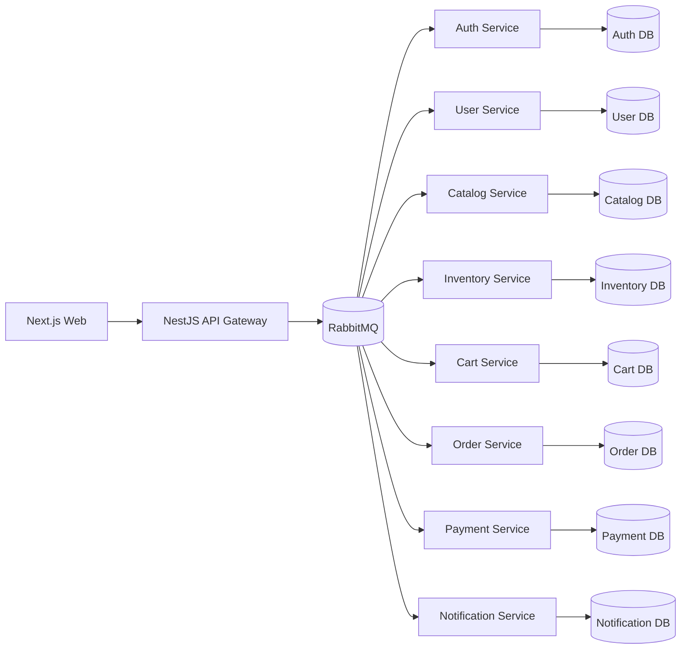

# Northlane Apparel

Northlane Apparel is the foundation for a professional event-driven apparel e-commerce platform. The repository is currently in **Phase 15**: it includes the monorepo foundation, local infrastructure, API Gateway, RabbitMQ-backed domain services, checkout saga wiring, customer and admin frontends, critical automated tests, and a live browser E2E harness against Docker-backed infrastructure.

## Current Scope

Implemented now:

- npm workspaces.
- Turborepo as a script orchestrator only.
- Strict TypeScript base configuration.
- Next.js storefront with public catalog, product detail, auth, bag, checkout and protected account pages.
- Next.js admin desk for catalog, stock and order operations guarded by the ADMIN role.
- NestJS API Gateway base in `apps/api-gateway` with `/api/v1`, health check, typed environment configuration, CORS, Helmet, rate limiting, structured request logs, correlation IDs, validation pipe and consistent error responses.
- Auth Service with Prisma-owned credentials tables, bcrypt password hashing, JWT access tokens, refresh tokens and RabbitMQ request/reply handlers.
- User Service with Prisma-owned profiles and addresses, plus `UserRegisteredEvent` consumption to create the initial profile.
- Catalog Service with Prisma-owned products, variants, images, categories, brands, collections, slugs, SEO fields, filters, search and realistic apparel seed data.
- Inventory Service with Prisma-owned inventory items, stock reservations, stock movements, row-level locking, reservation expiration, idempotency and stock events.
- Cart Service with Prisma-owned carts and cart items, product snapshots and catalog validation through RabbitMQ request/reply.
- Order Service with Prisma-owned orders, order items, status history, checkout idempotency and snapshot-based order history.
- Payment Service with Prisma-owned payments, payment events, MOCK approval/rejection rules and command idempotency.
- Notification Service with Prisma-owned notification history, simulated email logs and a RabbitMQ DLQ for failed notification events.
- Event-driven checkout completion across order, inventory, payment, cart and notification services.
- Critical automated tests for auth, user profiles, catalog creation, cart, inventory, order idempotency, checkout success/failure, RabbitMQ handlers, API Gateway guards and frontend form validation.
- Live browser E2E that boots RabbitMQ, PostgreSQL, Redis, all implemented services, API Gateway and the Next.js storefront, then executes a real checkout flow.
- Eight NestJS service shells under `services/*`.
- Prisma schema and migrations for implemented services; placeholders remain for future services.
- Shared and contracts packages.
- Local Docker Compose infrastructure for RabbitMQ, PostgreSQL and Redis.
- Initial Terraform directory without cloud infrastructure.
- Root Makefile with initial local commands.

Not implemented yet:

- CI/CD or AWS deployment.

## Target Architecture



## Repository Layout

```text
apps/
  web/
  api-gateway/
services/
  auth-service/
  user-service/
  catalog-service/
  inventory-service/
  cart-service/
  order-service/
  payment-service/
  notification-service/
packages/
  shared/
  contracts/
infra/
  docker/
  terraform/
docs/
```

## Commands

```bash
make install
make dev
make up
make down
make logs
make build
make lint
make test
make test-e2e
make test-e2e-live
make clean
```

Equivalent npm commands:

```bash
npm install
npm run dev
npm run build
npm run lint
npm test
npm run test:e2e
npm run test:e2e:live
npm run clean
```

## Testing

The default suite is deterministic and does not require PostgreSQL, RabbitMQ or Docker. It exercises
business behavior using Vitest, in-memory Prisma doubles and captured RabbitMQ subscriptions where a
real broker would make fast feedback flaky.

```bash
make test
npm test
```

Coverage is concentrated on:

- Auth register/login sessions.
- User profile updates and frontend auth/address form validation.
- Catalog product creation with categories, variants and media.
- Cart item add/update/remove behavior and product snapshots.
- Inventory reserve/confirm/release stock behavior, stock failure events and command handler retry/DLQ configuration.
- Order snapshots, checkout idempotency and checkout success/failure saga behavior.
- RabbitMQ auth/inventory message handlers and API Gateway JWT/admin guards.

The deterministic checkout smoke harness is exposed separately:

```bash
npm run test:e2e
make test-e2e
```

That target runs the order-service checkout success and payment failure scenarios through the
service-level saga harness with controlled cart and RabbitMQ doubles. A future Docker-backed job can
coexist with the fast local suite without making day-to-day feedback slow or flaky.

The live browser harness is exposed independently:

```bash
npm run test:e2e:live
make test-e2e-live
```

That command:

- boots `postgres`, `rabbitmq` and `redis` through Docker Compose under the isolated `northlane-e2e` project
- resets the service-owned Prisma schemas inside an isolated E2E database
- seeds the real catalog
- bootstraps authoritative inventory items from the seeded catalog variants
- starts every implemented backend service plus API Gateway and the Next.js storefront
- drives a browser through register, catalog navigation, add-to-bag, checkout, order confirmation and history verification

Artifacts and process logs are written to `tmp/e2e-live`. The default browser channel is `msedge` to avoid downloading Chromium on Windows. If Edge is unavailable, install a Playwright browser manually and override `PLAYWRIGHT_BROWSER_CHANNEL`.

## Local Infrastructure

`make up` starts the local infrastructure required by later event-driven phases.

| Component              | Local URL / Port                      | Default credentials     |
| ---------------------- | ------------------------------------- | ----------------------- |
| API Gateway            | `http://localhost:4000/api/v1/health` | none                    |
| RabbitMQ AMQP          | `localhost:5672`                      | `northlane / northlane` |
| RabbitMQ Management UI | `http://localhost:15672`              | `northlane / northlane` |
| PostgreSQL             | `localhost:5432`                      | `northlane / northlane` |
| Redis                  | `localhost:6379`                      | none                    |

Use `make logs` to follow container logs and `make down` to stop the stack. Persistent data is stored in named Docker volumes.

## API Gateway

The public HTTP boundary is available under `/api/v1`.

| Endpoint                                 | Purpose                                                                                                                                      |
| ---------------------------------------- | -------------------------------------------------------------------------------------------------------------------------------------------- |
| `GET /api/v1/health`                     | Health check for local and future container probes.                                                                                          |
| `POST /api/v1/auth/register`             | Register a user through Auth Service request/reply.                                                                                          |
| `POST /api/v1/auth/login`                | Login and issue access/refresh tokens.                                                                                                       |
| `POST /api/v1/auth/refresh`              | Rotate refresh token and issue a new access token.                                                                                           |
| `GET /api/v1/me`                         | Get the authenticated user's profile.                                                                                                        |
| `PATCH /api/v1/me/profile`               | Update personal profile data.                                                                                                                |
| `GET /api/v1/me/addresses`               | List authenticated user's addresses.                                                                                                         |
| `POST /api/v1/me/addresses`              | Create an address for the authenticated user.                                                                                                |
| `GET /api/v1/products`                   | List active products with search, filters and sorting.                                                                                       |
| `GET /api/v1/products/:slug`             | Get active product detail by slug.                                                                                                           |
| `GET /api/v1/categories`                 | List active catalog categories.                                                                                                              |
| `GET /api/v1/admin/products`             | List all products, including inactive products. Requires ADMIN JWT.                                                                          |
| `POST /api/v1/admin/products`            | Create a product through Catalog Service. Requires ADMIN JWT.                                                                                |
| `PATCH /api/v1/admin/products/:id`       | Update product merchandising fields. Requires ADMIN JWT.                                                                                     |
| `PATCH /api/v1/admin/products/:id/stock` | Adjust stock for a product variant through Inventory Service. Requires ADMIN JWT.                                                            |
| `GET /api/v1/cart`                       | Get the authenticated user's active cart.                                                                                                    |
| `POST /api/v1/cart/items`                | Add an item to the authenticated user's cart.                                                                                                |
| `PATCH /api/v1/cart/items/:itemId`       | Update cart item quantity.                                                                                                                   |
| `DELETE /api/v1/cart/items/:itemId`      | Remove a cart item.                                                                                                                          |
| `DELETE /api/v1/cart`                    | Clear the active cart.                                                                                                                       |
| `POST /api/v1/checkout`                  | Create an idempotent base order from the authenticated user's active cart. Requires `Idempotency-Key` header or `idempotencyKey` body field. |
| `GET /api/v1/orders`                     | List the authenticated user's order history.                                                                                                 |
| `GET /api/v1/orders/:id`                 | Get an authenticated user's order detail with item snapshots and status history.                                                             |
| `GET /api/v1/admin/orders`               | List all orders. Requires ADMIN JWT.                                                                                                         |
| `PATCH /api/v1/admin/orders/:id/status`  | Change an order status and append status history. Requires ADMIN JWT.                                                                        |

Every HTTP response includes or propagates `x-correlation-id`. Request logs are emitted as JSON and include the same correlation ID. Unhandled and HTTP errors use a consistent envelope with `success`, `statusCode`, `error`, `correlationId`, `path`, `method` and `timestamp`.

## Web Storefront

`apps/web` calls only API Gateway via `NEXT_PUBLIC_API_GATEWAY_URL`. It uses TanStack Query for Gateway server state, Zustand for session and UI-only bag/toast state, and React Hook Form with Zod for auth, profile and address validation. Public product pages include dynamic product metadata, image optimization and clean slug routes.

## Service Boundary Intent

- `apps/web`: customer storefront and account frontend.
- `apps/api-gateway`: future public HTTP boundary for the frontend.
- `auth-service`: credentials, tokens and roles.
- `user-service`: profiles, addresses and contact data.
- `catalog-service`: products, categories, variants and merchandising data.
- `inventory-service`: stock ownership and reservations.
- `cart-service`: user carts and cart item snapshots.
- `order-service`: checkout saga state and order history.
- `payment-service`: MOCK payment processing and payment event history.
- `notification-service`: email and notification history.

## Development Notes

Each service has its own `prisma/schema.prisma` file and isolated PostgreSQL schema. Domain models and migrations are added only when a service reaches its implementation phase.

Implemented service migrations can be applied independently:

```bash
npm run prisma:migrate --workspace @northlane/auth-service
npm run prisma:migrate --workspace @northlane/user-service
npm run prisma:migrate --workspace @northlane/catalog-service
npm run prisma:migrate --workspace @northlane/inventory-service
npm run prisma:migrate --workspace @northlane/cart-service
npm run prisma:migrate --workspace @northlane/order-service
npm run prisma:migrate --workspace @northlane/payment-service
npm run prisma:migrate --workspace @northlane/notification-service
npm run seed --workspace @northlane/catalog-service
```

RabbitMQ is available locally as infrastructure and is used by the auth/user/catalog/inventory/cart/order/payment/notification request-reply flow plus implemented domain events. Notification Service consumes user, order and payment events, persists notification history and simulates email delivery with JSON logs. Failed notification event handling is routed to `notification.events.dlq`.

## Checkout Saga

`POST /api/v1/checkout` publishes `order.command.create_order`. Order Service creates the `PENDING` order idempotently, publishes `inventory.command.reserve_stock`, reacts to `inventory.event.stock_reserved`, moves the order through `STOCK_RESERVED` and `PAYMENT_PENDING`, then publishes `payment.command.request_payment`.

Payment Service processes MOCK payment idempotently and publishes either `payment.event.payment_succeeded` or `payment.event.payment_failed`. Success moves the order to `PAID` and `CONFIRMED`, publishes `inventory.command.confirm_stock`, clears the cart through `cart.command.clear_cart` and emits `order.event.order_confirmed`. Failure moves the order to `FAILED` and `CANCELLED`, publishes `inventory.command.release_stock` and emits `order.event.order_cancelled`.
