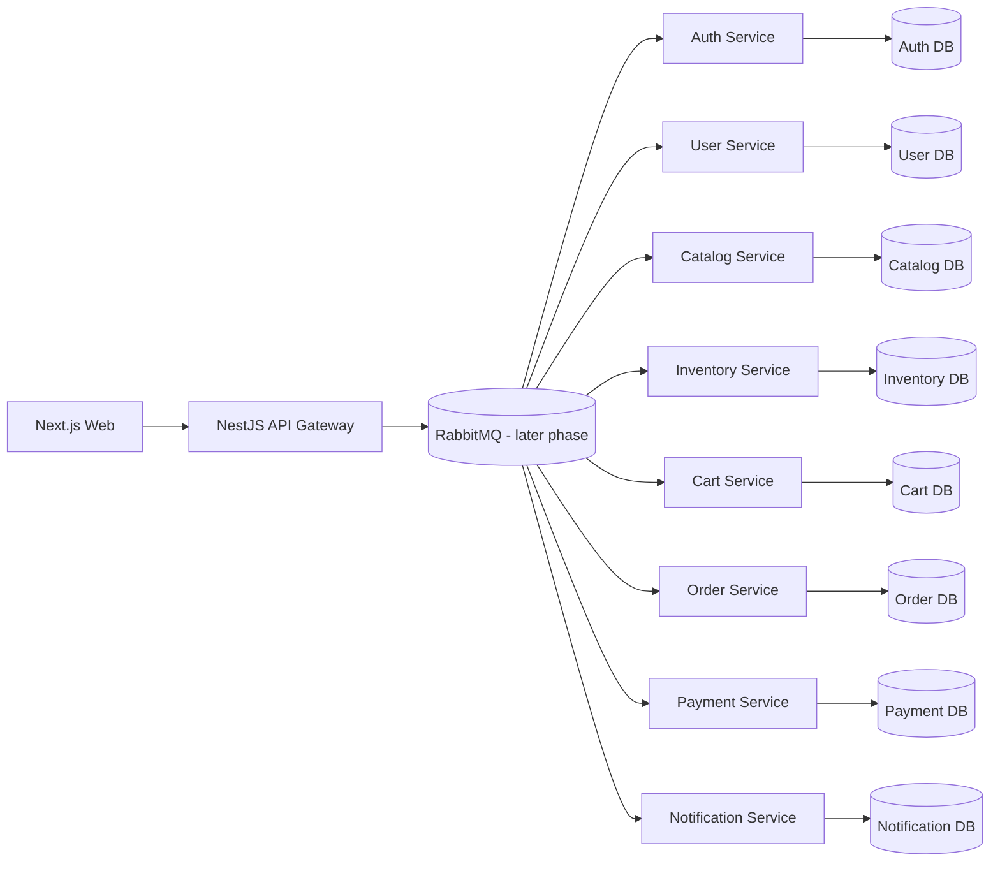

# Northlane Apparel

Northlane Apparel is the foundation for a professional event-driven apparel e-commerce platform. The repository is intentionally in **Phase 1**: it defines the monorepo structure, tooling, service boundaries and initial documentation without implementing business workflows yet.

## Phase 1 Scope

Implemented now:

- npm workspaces.
- Turborepo as a script orchestrator only.
- Strict TypeScript base configuration.
- Minimal Next.js app in `apps/web`.
- Minimal NestJS API Gateway in `apps/api-gateway`.
- Eight NestJS service shells under `services/*`.
- Prisma schema placeholder per service.
- Shared and contracts packages.
- Initial Docker and Terraform directories without runtime infrastructure.
- Root Makefile with minimal commands.

Not implemented yet:

- RabbitMQ topology or messaging code.
- PostgreSQL, Redis or Docker Compose runtime infrastructure.
- Product catalog, cart, checkout, orders or payments.
- Complete frontend UI.
- CI/CD or AWS deployment.

## Target Architecture



## Repository Layout

```text
apps/
  web/
  api-gateway/
services/
  auth-service/
  user-service/
  catalog-service/
  inventory-service/
  cart-service/
  order-service/
  payment-service/
  notification-service/
packages/
  shared/
  contracts/
infra/
  docker/
  terraform/
docs/
```

## Commands

```bash
make install
make dev
make build
make lint
make test
make clean
```

Equivalent npm commands:

```bash
npm install
npm run dev
npm run build
npm run lint
npm test
npm run clean
```

## Service Boundary Intent

- `apps/web`: future customer and admin frontend.
- `apps/api-gateway`: future public HTTP boundary for the frontend.
- `auth-service`: credentials, tokens and roles.
- `user-service`: profiles, addresses and contact data.
- `catalog-service`: products, categories, variants and merchandising data.
- `inventory-service`: stock ownership and reservations.
- `cart-service`: user carts and cart item snapshots.
- `order-service`: checkout saga state and order history.
- `payment-service`: payment processing abstraction.
- `notification-service`: email and notification history.

## Development Notes

Each service has its own `prisma/schema.prisma` file with an isolated datasource placeholder. Domain models and migrations are intentionally deferred until the corresponding service is implemented.

RabbitMQ, Docker Compose, PostgreSQL and Redis will be introduced in later phases after the monorepo foundation is stable.
