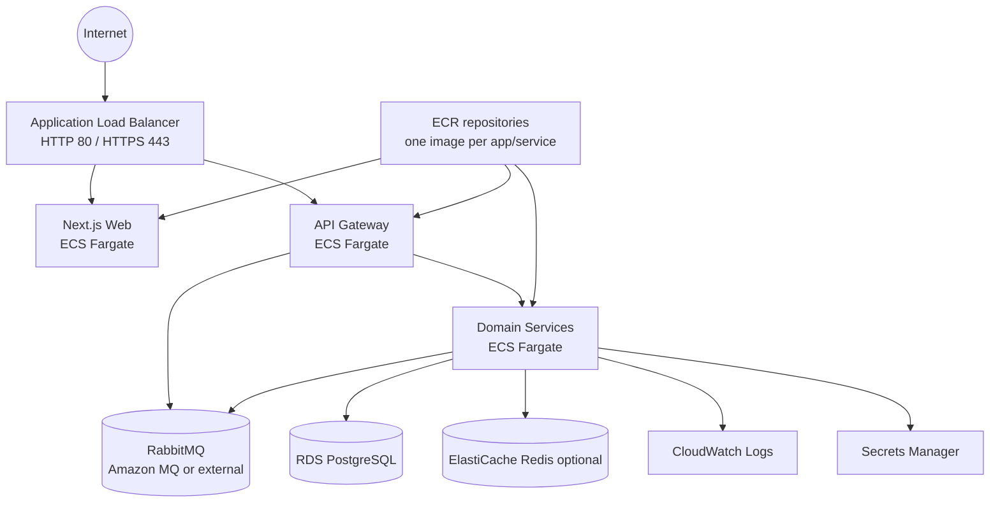

# AWS Architecture

This phase adds documented Terraform infrastructure for a development-grade AWS deployment of Northlane Apparel on ECS Fargate.

## Target Shape

## Network

- One VPC with public and private subnets across at least two Availability Zones.
- Public subnets host the ALB.
- Private subnets host RDS, optional Redis and optional Amazon MQ.
- ECS services can run in public subnets with public IPs for low-cost dev, or private subnets when `enable_nat_gateway = true`.
- NAT Gateway is disabled by default because it is one of the largest fixed monthly costs in a small dev environment.

## Load Balancer And HTTPS

The ALB module creates:

- HTTP listener on port `80`.
- HTTPS listener on port `443` when `certificate_arn` is provided.
- HTTP to HTTPS redirect when `certificate_arn` is provided.
- Default route to the web service.
- `/api/*` route to the API Gateway service.

Mercado Pago real payments require public HTTPS URLs. For that flow, provide an ACM certificate ARN and point DNS to the ALB.

Required public URLs for Mercado Pago:

- `https://<domain>/api/v1/payments/mercado-pago/webhook`
- `https://<domain>/es/payment/success`
- `https://<domain>/es/payment/failure`
- `https://<domain>/es/payment/pending`

## Compute

ECS Fargate services are defined for:

- `web`
- `api-gateway`
- `auth-service`
- `user-service`
- `catalog-service`
- `inventory-service`
- `cart-service`
- `order-service`
- `payment-service`
- `notification-service`

The Terraform default keeps `ecs_desired_count = 0`. This lets `terraform plan` and initial infrastructure creation succeed before secrets and ECR images are ready. Set it to `1` when images are pushed and Secrets Manager values are populated.

Each ECS service uses its own ECR repository and image tag. `make deploy` builds and pushes a new image tag for every app/service, then applies Terraform with that tag so task definitions are updated together.

## Data Stores

RDS PostgreSQL is created in private subnets with:

- storage encryption enabled
- private accessibility only
- AWS-managed master password in Secrets Manager
- automated backup retention configurable, with `0` as the dev Free Tier default
- deletion protection configurable

ElastiCache Redis is optional through `enable_redis`.

RabbitMQ is represented by an optional Amazon MQ module through `enable_rabbitmq`. You can also keep RabbitMQ external and inject `RABBITMQ_URL` through Secrets Manager.

## Secrets

Terraform creates Secrets Manager secret containers for:

- JWT secret
- RabbitMQ URL
- Mercado Pago credentials
- one Prisma database URL per service

Real secret values should be inserted outside source control. If you pass `secret_values` through Terraform, those values are stored in Terraform state.

## Security Groups

- ALB security group allows inbound `80` and `443` from configured CIDRs.
- ECS security group allows inbound service ports only from ALB.
- RDS security group allows PostgreSQL only from ECS.
- Redis security group allows Redis only from ECS when enabled.
- Amazon MQ security group allows AMQPS only from ECS when enabled.

## Cost Notes

Approximate monthly dev costs in `us-east-1`, before data transfer and traffic-driven usage:

| Resource | Default | Approximate cost |
| --- | --- | --- |
| ALB | enabled | about USD 20-25/month plus LCU usage |
| ECS Fargate | `ecs_desired_count = 0` | USD 0 until services are running |
| ECS Fargate all services | 9 small backend tasks + 1 web task | roughly USD 90-110/month running 24/7 |
| RDS PostgreSQL `db.t4g.micro` | enabled | roughly USD 12-25/month plus storage/backups |
| ECR | enabled | usually low for small images, billed by stored GB |
| CloudWatch Logs | enabled | depends on ingestion and retention |
| NAT Gateway | disabled | roughly USD 30+/month plus data when enabled |
| ElastiCache Redis `cache.t4g.micro` | optional | roughly USD 10-20/month when enabled |
| Amazon MQ RabbitMQ `mq.t3.micro` | optional | roughly USD 15-30/month when enabled |

Use AWS Pricing Calculator before leaving the environment running. Official pricing references:

- AWS Fargate pricing: https://aws.amazon.com/fargate/pricing/
- Elastic Load Balancing pricing: https://aws.amazon.com/elasticloadbalancing/pricing/
- Amazon RDS pricing: https://aws.amazon.com/rds/pricing/
- Amazon MQ pricing: https://aws.amazon.com/amazon-mq/pricing/
- ElastiCache pricing: https://aws.amazon.com/elasticache/pricing/
